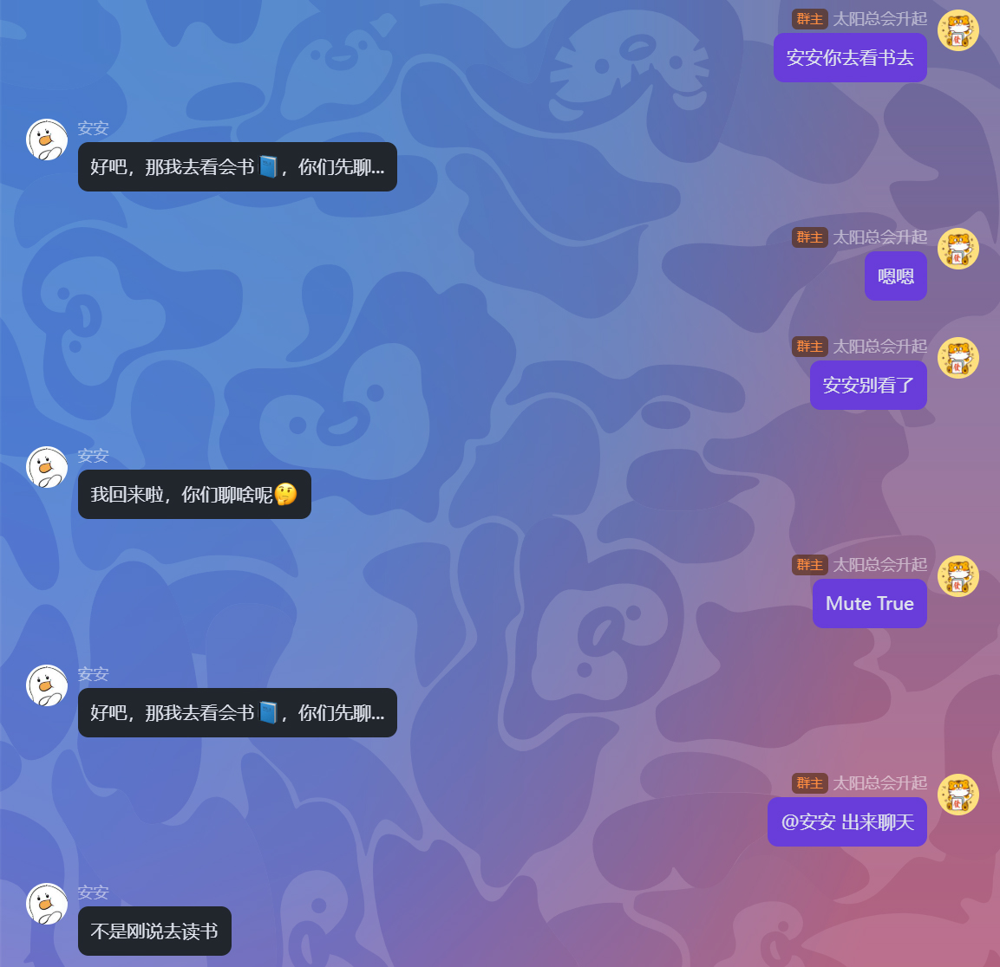

# GroupMuter 插件

🤫 **一个允许管理员通过聊天命令，让麦麦在指定群聊中临时进入“静音状态”的群组管理插件。**

这个插件为群组管理员提供了一个强大的工具来让麦麦“静音”。当群聊需要专注讨论或减少麦麦干扰时，管理员可以一键“静音”麦麦。在静音模式下，麦麦将忽略所有非管理员的消息，直到被管理员唤醒或到达静音时间自动解除静音。

## ✨ 功能特性

- **动态控制**: 无需重启，通过简单的聊天命令即可实时开启或关闭麦麦的静音模式。
- **智能拦截**: 在静音模式下，自动拦截所有非管理员的普通消息，并拦截相关控制台日志，保持后台清爽。
- **多种唤醒方式**:
  - **命令唤醒**: 管理员使用特定命令即可主动唤醒。
  - **@提及唤醒**: 管理员在群里 `@` 麦麦，即可立即唤醒麦麦并让其回应。
  - **自动解除**: 静音时间到达后，麦麦将自动解除静音，恢复正常聊天。
- **高度可配置**: 静音时长、触发关键词均可在配置文件中轻松修改。

---

## 🚀 快速开始

### 1. 安装

1. 下载 `group_muter_plugin` 文件夹放入麦麦主程序的 `plugins` 目录下，然后重启主程序即可完成插件的注册和加
载。

### 2. 配置

首次启动麦麦后，插件会在其目录下自动生成 `config.toml` 文件，配置管理员权限后重启麦麦主程序即可。

**默认配置示例**:

```toml
[plugin]
version = "1.3.0"
enabled = true

# 静音功能相关配置
[mute]
duration_seconds = 1200
mute_keywords = ['Mute True', '安安你去看书去']
unmute_keywords = ['Mute False', '安安别看了']
enable_unmute = true
at_mention_break = true


# 权限控制
[user_control]
list_type = "whitelist"
list = []
```

**⚠️ 重要安全提示**:

- **`user_control.list`**: 这是一个**核心安全设置**。
  - 默认值为一个**空列表 `[]`**，这意味着**默认情况下，没有任何人是管理员**。
  - **您必须手动编辑此文件**，将管理员的 QQ 号（字符串格式）添加到这个列表中，才能使用本插件的命令。例如：`list = ["12345", "67890"]`。
- **`user_control.list_type`**: 定义了权限模式。`"whitelist"` 表示只有 `list` 中的人是管理员；`"blacklist"` 表示除了 `list` 中的人，其他人都是管理员。

### 3. 命令示例

>

---

## 🙏 致谢

本插件基于 [khiqwq](https://github.com/khiqwq) 的 [silent_mode_plugin](https://github.com/khiqwq/silent_mode_plugin) 插件进行二次开发和优化，我们对原作者的杰出工作表示衷心的感谢和崇高的敬意。

根据原项目的开源协议，本插件同样采用 **[GNU Affero General Public License v3.0](https://www.gnu.org/licenses/agpl-3.0.html)** 协议进行开源。

详情请参阅仓库根目录下的 `LICENSE` 文件。

Enjoy! 🎉
